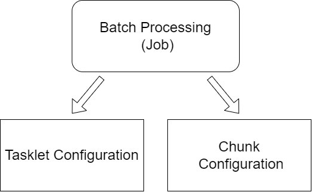
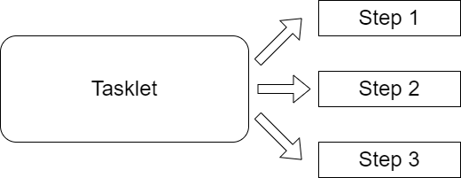

<h1>Batch processing</h1>

Batch processing is a technique used where a set of data is processed together as a group or "batch". We will often 
use batch processing as a way to efficiently manage server resources such as CPU and memory. In Spring, batch processing
is configured into jobs that need to be completed. Each job is typically configured with a tasklet or chunk oriented 
approach with the important caveat that a chunk configuration can build upon tasklet configuration.

This project demonstrates how to set up batch jobs with Spring tasklet and chunk oriented configurations.

    

<h1>Tasklet Oriented Configuration</h1>

Task oriented configuration refers to breaking the batch processing down into smaller units referred to ask tasklets.
Each task can then be broken down into intermediate steps required to complete the task

    

<h1>Chunk Oriented Configuration</h1>

Chunk oriented configuration refers to breaking the data down into smaller chunks. Each chunk is read, optionally processed, and
written in its chunk size. This is often done to avoid running out of memory when processing large data sets.

    

<h1> Running locally</h1>
This project explores setting up jobs to run in tasklet and chunk configurations. The chunk configurations are then 
expounded upon to prove out interfacing with different sources. 

To perform a REST call, use the following endpoint to start the appropriate job:

    localhost:8080/api/job/start/taskletJob

To run by command line arguments, pass the appropriate input file parameter and update the application properties 
to the desired job. Note for jdbc configurations, you will have to set up the appropriate data in Microsoft SQL Server.

    inputFile=C:\Git\spring-batch\InputFiles\students.csv
    inputFile=C:\Git\spring-batch\OutputFiles\students.csv

    spring.batch.job.name=chunkJob